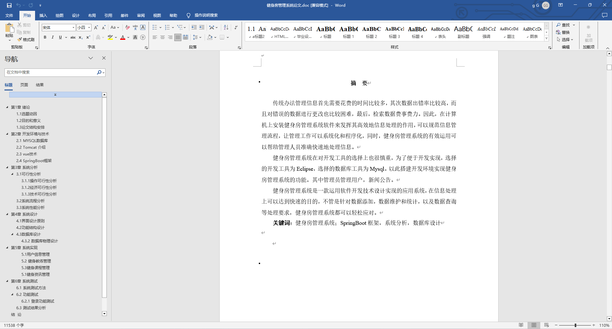
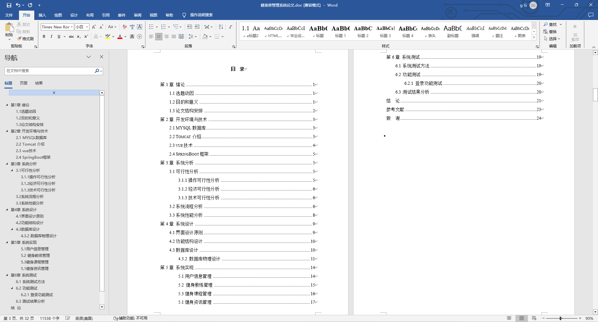
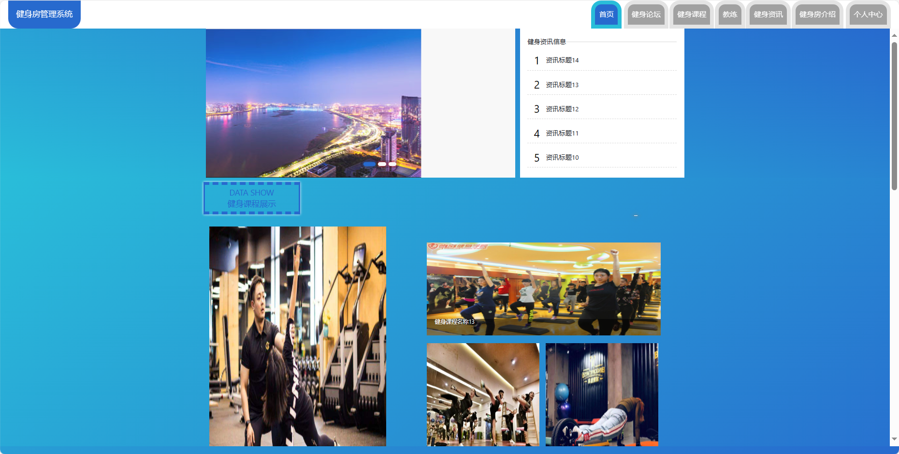
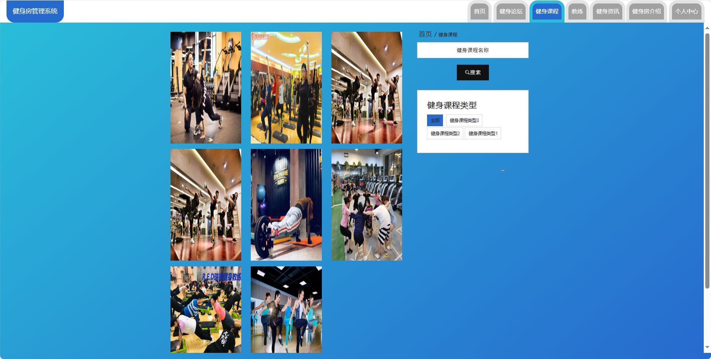
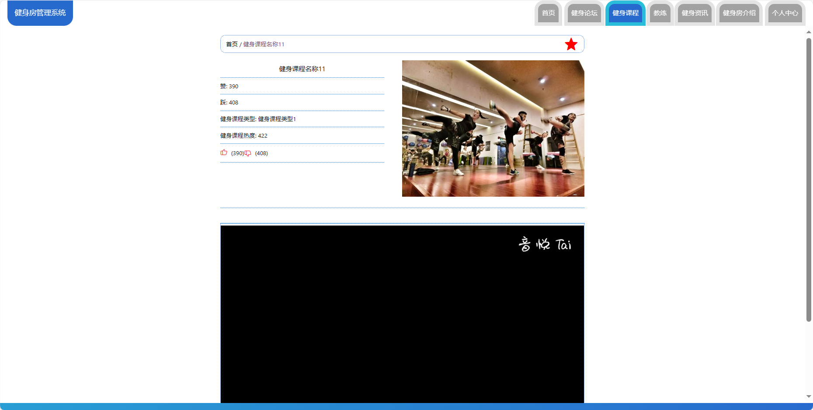
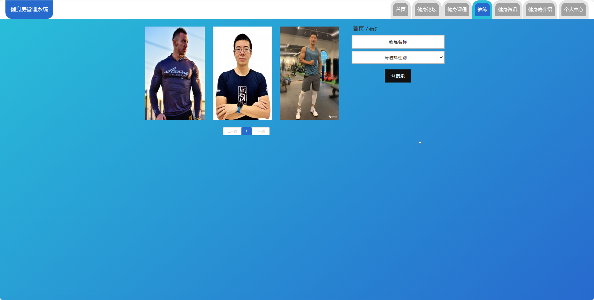
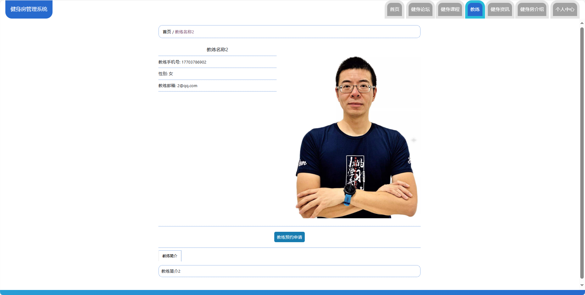

基于Springboot的健身房管理系统（程序+论文）
=
### 完整代码获取地址：从戎源码网 ([https://armycodes.com/](https://armycodes.com/))
### 作者微信：19941326836  QQ：952045282 
### 承接计算机毕业设计、Java毕业设计、Python毕业设计、深度学习、机器学习
### 选题+开题报告+任务书+程序定制+安装调试+论文+答辩ppt 一条龙服务
### 所有选题地址https://github.com/nature924/allProject

一、项目介绍
---
基于Spring Boot框架实现的健身房管理系统，系统包含三种角色：管理员、学员,教练主要功能如下。

### 【学员功能】

1. **首页：** 浏览最新的健身房信息。
2. **健身论坛：** 参与健身讨论，分享经验和建议。
3. **健身课程：** 查看和报名参加健身课程。
4. **教练：** 查看教练信息和排班，进行预约。
5. **健身资讯：** 获取最新的健身资讯和建议。
6. **健身房介绍：** 了解健身房的设施和特色。
7. **个人中心：** 管理个人信息，包括修改密码等。

### 【管理员功能】

1. **首页：** 查看整体系统的概况。
2. **个人中心：** 修改密码和管理个人信息。
3. **管理员管理：** 管理系统中的管理员账号。
4. **用户管理：** 管理学员的账号信息，包括审核注册。
5. **教练管理：** 管理教练的信息，包括添加、编辑和删除。
6. **教练预约申请管理：** 处理学员对教练的预约申请。
7. **健身课程管理：** 管理健身课程，包括添加、编辑和删除。
8. **健身资讯管理：** 发布和管理健身资讯。
9. **单页数据管理：** 管理健身房介绍等单页信息。
10. **基础数据管理：** 管理系统的基础数据，包括健身课程类型和资讯类型。
11. **健身论坛管理：** 管理健身讨论论坛的帖子和评论。
12. **轮播图信息：** 管理系统首页的轮播图。

### 【教练功能】

1. **首页：** 查看健身房信息。
2. **个人中心：** 修改密码和管理个人信息。
3. **教练预约申请管理：** 查看和处理学员的预约申请。
4. **健身课程管理：** 管理自己的健身课程，包括排班和内容。
5. **健身资讯管理：** 发布和管理健身资讯。
6. **健身论坛管理：** 参与健身讨论。

二、项目技术
---
- 编程语言：Java
- 数据库：MySQL
- 项目管理工具：Maven
- 前端技术：VUE、HTML、Jquery、Bootstrap
- 后端技术：Spring、SpringMVC、MyBatis

三、运行环境
---
- 操作系统：Windows、macOS都可以
- JDK版本：JDK1.8以上都可以
- 开发工具：IDEA、Ecplise、Myecplise都可以
- 数据库: MySQL5.7以上都可以
- Tomcat：任意版本都可以
- Maven：任意版本都可以

四、运行截图
---
### 论文截图：

### 程序截图：

